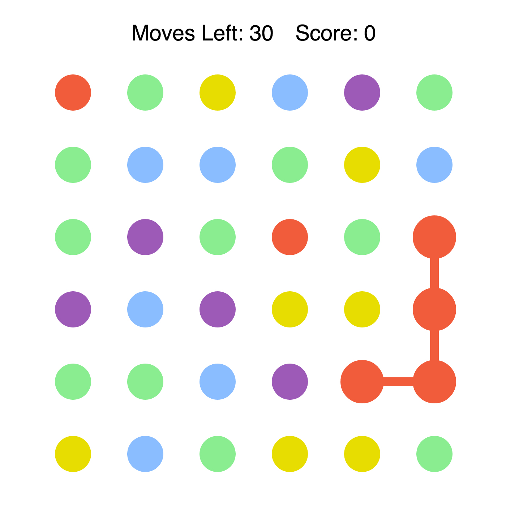
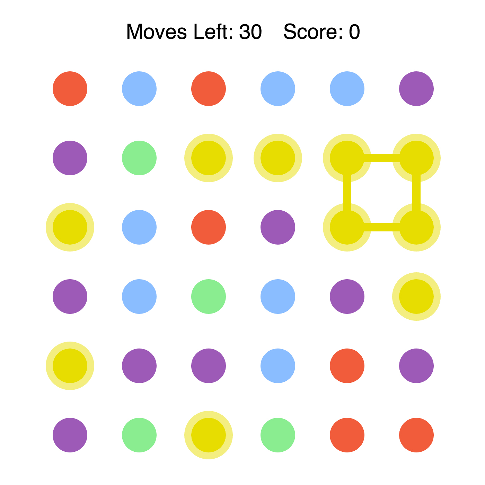

# Spots

### By Will McMeans

Spots is a game inspired by the mobile game Dots. The gameplay is simple: connect the dots and score points; form squares and rectangles to get the most points.

## Technology

Spots was created using JavaScript and jQuery.

## Screenshots

Connecting dots:

Making a square:

